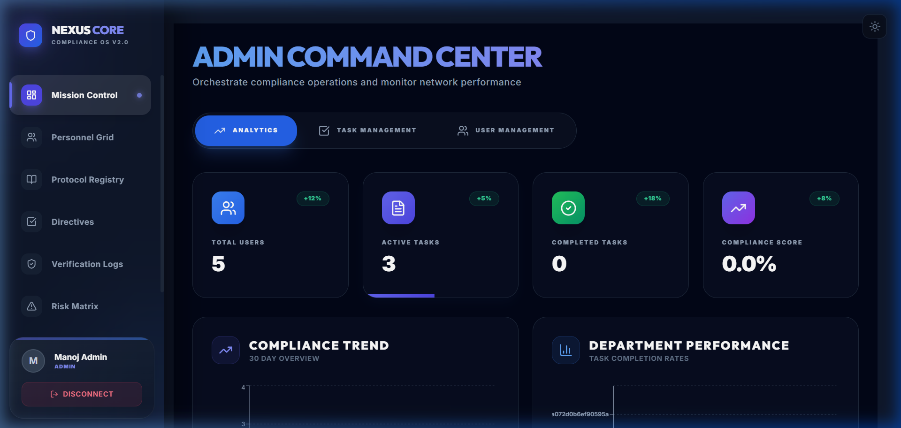
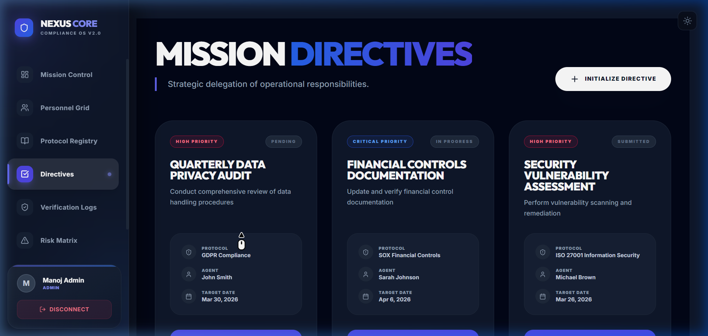
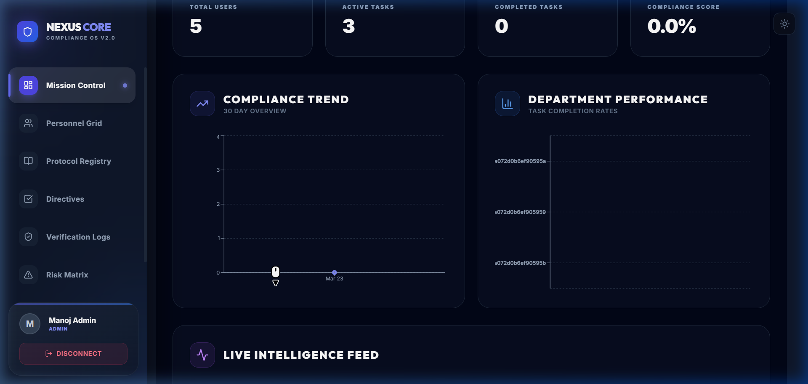
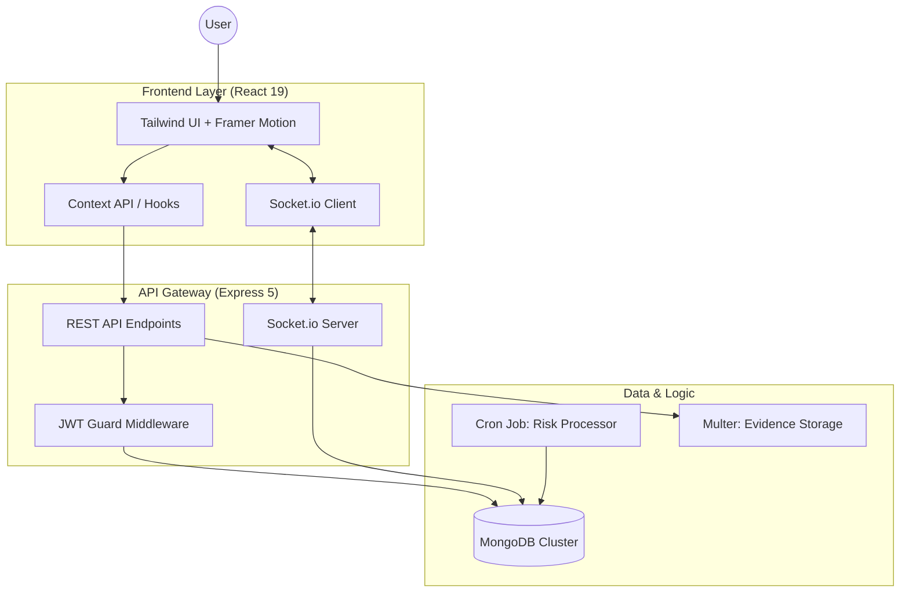

<div align="center">
  
  <h1>📋 Nexus Core: Compliance Management OS</h1>
  <p><strong>Orchestrating Organizational Compliance with Precision.</strong></p>

  [](https://opensource.org/licenses/MIT)
  [](https://nodejs.org/)
  [](https://www.mongodb.com/)
  [](https://reactjs.org/)
  [-000000)](https://expressjs.com/)
  [](#-screenshots)
  [](#-technical-core)
</div>

---



## 📌 Strategic Overview

**Nexus Core** is a sophisticated full-stack compliance ecosystem architected to centralize, automate, and verify regulatory governance. In an era of increasing legal complexity, Nexus Core bridges the gap between static requirements and dynamic organizational action. 

The system provides a "Single Source of Truth" for compliance officers, auditors, and employees, ensuring that your organization remains audit-ready through real-time telemetry, automated evidence collection, and high-performance analytics.

---

## 🗺️ Table of Contents

- [📸 Visual Showcase](#-visual-showcase)
- [✨ Key Capabilities](#-key-capabilities)
- [🛠️ Technical Stack](#%EF%B8%8F-technical-stack)
- [🚀 Quick Start](#-quick-start)
- [🏗️ System Architecture](#-system-architecture)
- [🔐 Technical Core & Security](#-technical-core--security)
- [📅 Roadmap 2024](#-roadmap-2024)
- [❓ Troubleshooting](#-troubleshooting)
- [📄 License](#-license)

---

## 📸 Visual Showcase

### 🖥️ Admin Command Center
The central nervous system of Nexus Core, providing a 360° view of organizational health.


### 📋 Mission Directives (Kanban Board)
Agile execution of compliance tasks with drag-and-drop mechanics and evidence requirements.


### 📊 Intelligence Feed (Analytics)
High-fidelity data visualization tracking compliance vectors and risk distribution.


---

## ✨ Key Capabilities

| Feature | Description | Business Value |
| :--- | :--- | :--- |
| **👥 RBAC Identity** | Advanced role-based access for Admins, Supervisors, and Employees. | Zero-Trust Security |
| **📅 Directive Engine** | Lifecycle management of compliance tasks with automated deadlines. | Operational Clarity |
| **🔍 Audit Trail** | Immutable logs and evidence-backed verification for every operation. | Audit Readiness |
| **📁 Evidence Vault** | Centralized, secure repository for regulatory documentation. | Data Integrity |
| **⚠️ Risk Matrix** | Predictive tools to identify and mitigate organizational friction. | Proactive Defense |
| **📊 Smart Export** | Instant PDF/Excel generation for boardroom-ready reporting. | Compliance Proof |
| **🔔 Live Telemetry** | Socket-driven real-time alerts and state updates. | Instant Awareness |
| **📈 Aggregated Intel** | Sub-second analytics crunching across departments. | Strategic Insight |

---

## 🛠️ Technical Stack

### 🎨 Frontend (Client)
- **Engine**: [React 19](https://reactjs.org/) + [Vite](https://vitejs.dev/)
- **Motion**: [Framer Motion](https://www.framer.com/motion/) for fluid UI transitions
- **Typography**: [Lucide React](https://lucide.dev/) + Inter UI
- **Styling**: [Tailwind CSS](https://tailwindcss.com/) (Custom UI Tokens)
- **Charts**: [Recharts](https://recharts.org/) & [Chart.js](https://www.chartjs.org/)

### ⚙️ Backend (Server)
- **Runtime**: [Node.js 20+](https://nodejs.org/)
- **API Framework**: [Express 5](https://expressjs.com/) (Experimental Features Enabled)
- **Database**: [MongoDB](https://www.mongodb.com/) (Mongoose 9.x)
- **Communication**: [Socket.io](https://socket.io/) for real-time binary streams
- **Operations**: [Node-Cron](https://www.npmjs.com/package/node-cron) for automated risk recalibration

---

## 🚀 Quick Start

### 1️⃣ Clone & Deploy
```bash
git clone https://github.com/yourusername/compliance-management.git
cd compliance-management
```

### 2️⃣ System Configuration
**Server Setup**:
```bash
cd server && npm install
cp .env.example .env # Update local MongoDB & JWT secrets
npm run seed        # Populate default roles and admin
npm run dev
```

**Client Setup**:
```bash
cd ../client && npm install
npm run dev
```

---

## 🔐 Technical Core & Security

### 🧠 Intelligence Engine
Nexus Core utilizes **MongoDB Aggregation Pipelines** to process complex relational data in a document-based store. The `analyticsController` crunches thousands of compliance vectors in milliseconds to provide live health scores.

### 🛡️ Security Architecture
- **JWT Rotation**: Secure token management with automatic refresh cycles.
- **Evidence Verification**: Document hashing ensures that uploaded evidence cannot be tampered with.
- **Rate Limiting**: Integrated `express-rate-limit` to prevent brute-force identity attacks.

### 📡 Real-time Sync
Powered by **Socket.io**, the system ensures that every user's dashboard is updated instantly when a "Directive" status changes or an "Audit" is triggered, eliminating the need for manual refreshes.

---

## 🏗️ System Architecture



---

## 📅 Roadmap 2024

- [ ] **AI-Powered Risk Prediction**: Machine learning models to forecast compliance failures.
- [ ] **Mobile OS Integration**: Native iOS/Android apps for on-the-go auditing.
- [ ] **External API Connectors**: Integration with Jira, Slack, and Microsoft Teams.
- [ ] **Blockchain Evidence**: Storing document hashes on-chain for absolute immutability.

---

## ❓ Troubleshooting

| Issue | Resolution |
| :--- | :--- |
| **MongoDB Connection Failure** | Ensure MongoDB is running locally on port 27017 or update `MONGO_URI` in `.env`. |
| **Unauthorized (401) Errors** | Check if your `JWT_SECRET` matches between server restarts. Clear browser cache. |
| **Assets Not Loading** | Run `npm run seed` to ensure all reference data exists in the database. |
| **Build Errors** | Ensure you are using Node.js v20+ and have run `npm install` in both directories. |

---

## 📄 License

Distributed under the **MIT License**. See `LICENSE` for more information.

---

<p align="center">
  Built with ❤️ for a more compliant world. <br/>
  <b>Nexus Core Compliance OS</b>
</p>
