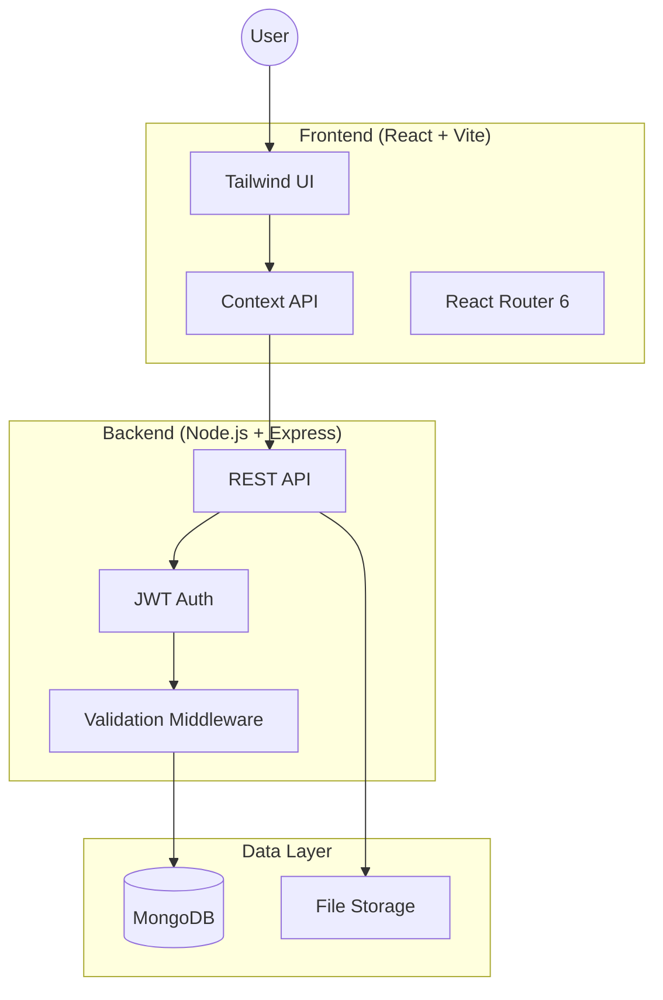

# 📋 Compliance Management System

[](https://opensource.org/licenses/MIT)
[](https://nodejs.org/)
[](https://www.mongodb.com/)
[](https://reactjs.org/)
[](https://expressjs.com/)


## 📌 Overview

A comprehensive full-stack web application designed to streamline compliance management within organizations. This system enables tracking regulations, managing tasks, conducting audits, generating reports, and ensuring regulatory adherence through an intuitive user interface and robust backend API.

## 🗺️ Table of Contents

- [📸 Screenshots](#-screenshots)
- [🎬 Demo](#-demo)
- [✨ Features](#-features)
- [🛠️ Technologies Used](#%EF%B8%8F-technologies-used)
- [📋 Prerequisites](#-prerequisites)
- [🚀 Installation](#-installation)
- [🧱 Project Structure](#-project-structure)
- [🧪 API Documentation](#-api-documentation)
- [🤝 Contributing](#-contributing)
- [📄 License](#-license)

## 📸 Screenshots

### 🖥️ Admin Command Center


### 📋 Mission Directives (Kanban Board)


### 📊 Intelligence Feed (Analytics)


## 🎬 System in Action (Animations)

The Nexus Core Compliance OS v2.0 is designed for a fluid, animated experience.

### 🌓 Theme Intelligence


### 📈 Dynamic Analytics Load


### 🧩 Interactive Flow


*The system orchestrates complex compliance data with seamless, real-time animations.*

## ✨ Features

The Compliance Management System is packed with powerful features to ensure your organization stays compliant and organized.

| Feature | Description | Role Access |
| :--- | :--- | :--- |
| **👥 User Management** | Secure role-based access for Admins, Employees, and Auditors. | Admin |
| **📅 Task Management** | Assign, track, and manage compliance tasks with an interactive Kanban board. | All Roles |
| **🔍 Audit System** | Schedule and conduct comprehensive audits with evidence attachment. | Auditor / Admin |
| **📁 Documents** | Centralized repository for all compliance-related documentation. | All Roles |
| **⚠️ Risk Assessment** | Advanced tools to identify, analyze, and mitigate organizational risks. | Admin / Auditor |
| **📊 Smart Reporting** | One-click generation of detailed PDF and Excel compliance reports. | Admin |
| **🔔 Live Alerts** | Real-time notifications for deadlines, task updates, and audit schedules. | All Roles |
| **📈 Analytics** | Dynamic dashboard with real-time visualization of compliance metrics. | Admin |

---

## 🛠️ Technologies Used

### 🎨 Frontend (Client)
- **Framework**: [React 18](https://reactjs.org/) with [Vite](https://vitejs.dev/)
- **Styling**: [Tailwind CSS](https://tailwindcss.com/)
- **Networking**: [Axios](https://axios-http.com/)
- **State**: Context API
- **Routing**: React Router 6

### ⚙️ Backend (Server)
- **Runtime**: [Node.js](https://nodejs.org/)
- **Logic**: [Express.js](https://expressjs.com/)
- **Database**: [MongoDB](https://www.mongodb.com/) with [Mongoose](https://mongoosejs.com/)
- **Security**: [JWT (JSON Web Tokens)](https://jwt.io/)
- **Files**: [Multer](https://github.com/expressjs/multer)
- **Jobs**: [Node-Cron](https://www.npmjs.com/package/node-cron)

## 📋 Prerequisites

Before running the application, ensure you have the following installed:
- 🟢 [Node.js](https://nodejs.org/en/) (v14 or higher)
- 🍃 [MongoDB](https://www.mongodb.com/try/download/community) (running locally on port 27017)
- 📦 npm or yarn package manager

## 🚀 Installation & Setup

Follow these steps to get the system up and running on your local machine.

### 1️⃣ Clone the Repository
```bash
git clone https://github.com/yourusername/compliance-management.git
cd compliance-management
```

### 2️⃣ Backend Configuration (Server)
1. **Install Dependencies**:
   ```bash
   cd server
   npm install
   ```
2. **Environment Setup**: Create a `.env` file in the `server` folder:
   ```env
   PORT=5000
   MONGO_URI=mongodb://127.0.0.1:27017/cms_db
   JWT_SECRET=your_secret_key
   ```
3. **Seed Database**:
   ```bash
   npm run seed
   ```
4. **Start Server**:
   ```bash
   npm run dev
   ```

### 3️⃣ Frontend Configuration (Client)
1. **Install Dependencies**:
   ```bash
   cd ../client
   npm install
   ```
2. **Start Development Server**:
   ```bash
   npm run dev
   ```

---

## 🏗️ System Architecture

The system follows a modern MERN-stack architecture with a focus on security and scalability.



## 🏗️ Project Structure

```
compliance_management/
├── client/                 # React frontend application
│   ├── src/
│   │   ├── components/     # Reusable UI components
│   │   ├── pages/          # Page components
│   │   ├── context/        # React context providers
│   │   └── api/            # API configuration
│   └── public/             # Static assets
├── server/                 # Node.js backend API
│   ├── src/
│   │   ├── controllers/    # Route handlers
│   │   ├── models/         # MongoDB schemas
│   │   ├── routes/         # API routes
│   │   ├── middleware/     # Custom middleware
│   │   └── utils/          # Utility functions
│   └── uploads/            # File upload directory
└── README.md
```

## Contributing

1. Fork the repository
2. Create a feature branch (`git checkout -b feature/AmazingFeature`)
3. Commit your changes (`git commit -m 'Add some AmazingFeature'`)
4. Push to the branch (`git push origin feature/AmazingFeature`)
5. Open a Pull Request

## License

This project is licensed under the MIT License - see the [LICENSE](LICENSE) file for details.

## Support

For support, email support@compliance-management.com or create an issue in the repository.
