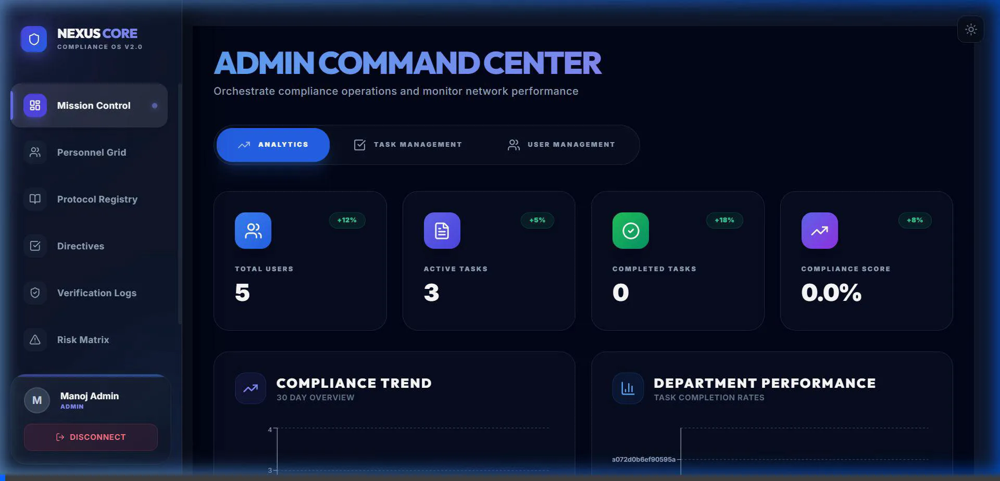
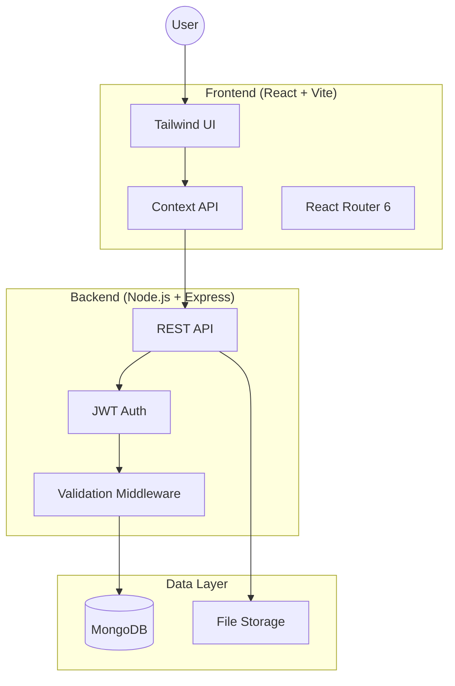

# 📋 Nexus Core: Compliance Management OS

> **Orchestrating Organizational Compliance with Precision.**

[](https://opensource.org/licenses/MIT)
[](https://nodejs.org/)
[](https://www.mongodb.com/)
[](https://reactjs.org/)
[](https://expressjs.com/)
[](#-screenshots)

---


## 📌 Overview

**Nexus Core** is a sophisticated full-stack compliance ecosystem designed to centralize and automate regulatory governance. By bridging the gap between legal requirements and actionable tasks, Nexus Core ensures that your organization remains audit-ready and secure through real-time intelligence and animated data visualization.

## 🗺️ Table of Contents

- [📸 Screenshots](#-screenshots)
- [🎬 Demo](#-demo)
- [✨ Features](#-features)
- [🛠️ Technologies Used](#%EF%B8%8F-technologies-used)
- [📋 Prerequisites](#-prerequisites)
- [🚀 Installation](#-installation)
- [🧱 Project Structure](#-project-structure)
- [🧪 API Documentation](#-api-documentation)
- [🤝 Contributing](#-contributing)
- [📄 License](#-license)

## 📸 Screenshots

### 🖥️ Admin Command Center


### 📋 Mission Directives (Kanban Board)


### 📊 Intelligence Feed (Analytics)


## 🎬 System in Action (Animations)

The Nexus Core Compliance OS v2.0 is designed for a fluid, animated experience.

### 🌓 Theme Intelligence


### 📈 Dynamic Analytics Load


### 🧩 Interactive Flow


*The system orchestrates complex compliance data with seamless, real-time animations.*

## ✨ Features

The Compliance Management System is packed with powerful features to ensure your organization stays compliant and organized.

| Feature | Description | Role Access |
| :--- | :--- | :--- |
| **👥 User Management** | Secure role-based access for Admins, Employees, and Auditors. | Admin |
| **📅 Task Management** | Assign, track, and manage compliance tasks with an interactive Kanban board. | All Roles |
| **🔍 Audit System** | Schedule and conduct comprehensive audits with evidence attachment. | Auditor / Admin |
| **📁 Documents** | Centralized repository for all compliance-related documentation. | All Roles |
| **⚠️ Risk Assessment** | Advanced tools to identify, analyze, and mitigate organizational risks. | Admin / Auditor |
| **📊 Smart Reporting** | One-click generation of detailed PDF and Excel compliance reports. | Admin |
| **🔔 Live Alerts** | Real-time notifications for deadlines, task updates, and audit schedules. | All Roles |
| **📈 Analytics** | Dynamic dashboard with real-time visualization of compliance metrics. | Admin |

---

## 🛠️ Technologies Used

### 🎨 Frontend (Client)
- **Framework**: [React 18](https://reactjs.org/) with [Vite](https://vitejs.dev/)
- **Styling**: [Tailwind CSS](https://tailwindcss.com/)
- **Networking**: [Axios](https://axios-http.com/)
- **State**: Context API
- **Routing**: React Router 6

### ⚙️ Backend (Server)
- **Runtime**: [Node.js](https://nodejs.org/)
- **Logic**: [Express.js](https://expressjs.com/)
- **Database**: [MongoDB](https://www.mongodb.com/) with [Mongoose](https://mongoosejs.com/)
- **Security**: [JWT (JSON Web Tokens)](https://jwt.io/)
- **Files**: [Multer](https://github.com/expressjs/multer)
- **Jobs**: [Node-Cron](https://www.npmjs.com/package/node-cron)

## 📋 Prerequisites

Before running the application, ensure you have the following installed:
- 🟢 [Node.js](https://nodejs.org/en/) (v14 or higher)
- 🍃 [MongoDB](https://www.mongodb.com/try/download/community) (running locally on port 27017)
- 📦 npm or yarn package manager

## 🚀 Installation & Setup

Follow these steps to get the system up and running on your local machine.

### 1️⃣ Clone the Repository
```bash
git clone https://github.com/yourusername/compliance-management.git
cd compliance-management
```

### 2️⃣ Backend Configuration (Server)
1. **Install Dependencies**:
   ```bash
   cd server
   npm install
   ```
2. **Environment Setup**: Create a `.env` file in the `server` folder:
   ```env
   PORT=5000
   MONGO_URI=mongodb://127.0.0.1:27017/cms_db
   JWT_SECRET=your_secret_key
   ```
3. **Seed Database**:
   ```bash
   npm run seed
   ```
4. **Start Server**:
   ```bash
   npm run dev
   ```

### 3️⃣ Frontend Configuration (Client)
1. **Install Dependencies**:
   ```bash
   cd ../client
   npm install
   ```
2. **Start Development Server**:
   ```bash
   npm run dev
   ```

---

## 🛠️ Technical Core

### 🔐 Security & Identity
- **JWT Authentication**: Secure token-based auth with automatic **Refresh Token** rotation.
- **RBAC (Role-Based Access Control)**: Granular permissions for Admin, Supervisor, and Employee roles.
- **Session Management**: Multi-device logout support and security-hardened middleware.

### 🧠 Intelligence Engine
- **Compliance Scoring**: Real-time calculation of organizational compliance based on task approvals.
- **Aggregate Analytics**: High-performance MongoDB aggregation for department-level metrics.
- **Trend Analysis**: Statistical tracking of compliance health over 30-day windows.

### 🛡️ Data Integrity
- **Audit Guardians**: Comprehensive activity logging for every sensitive operation.
- **Evidence Vault**: Secure storage and mapping of evidentiary documents to compliance tasks.

## 🏗️ System Architecture

The system follows a modern MERN-stack architecture with a focus on security and scalability.



---

## 🚀 API Reference (Enterprise core)

| Category | Endpoint | Method | Access | Description |
|---|---|---|---|---|
| **Auth** | `/api/auth/login` | `POST` | Public | Authenticate and obtain JWT |
| **Auth** | `/api/auth/me` | `GET` | Private | Retrieve user identity profile |
| **Directives** | `/api/tasks` | `GET` | Private | Fetch scoped compliance tasks |
| **Directives** | `/api/tasks` | `POST` | Admin+ | Instantiate new compliance mission |
| **Intelligence** | `/api/analytics/overview` | `GET` | Admin | Real-time dashboard telemetry |
| **Intelligence** | `/api/analytics/trend` | `GET` | Admin | 30-day compliance health vector |

## 🧩 Component Deep-Dive

### ⚡ Nexus Layout Engine
Located in `client/src/components/Layout.jsx`, this core component manages the global state of the "Nexus Core" UI, including the **Dark/Light Mode** synchronization and the responsive **Liquid Sidebar** navigation.

### 🧪 Analytics Processor
The `analyticsController.js` on the backend utilizes high-performance **MongoDB Aggregation Pipelines** to crunch compliance data across departments in milliseconds.

---

## 🚦 Core Workflows

1. **Strategic Planning**: Admins define regulations and map them to actionable "Missions".
2. **Directive Execution**: Employees complete "Directives" and upload verifiable evidence.
3. **Audit Verification**: Supervisors review evidence and approve/reject directives in real-time.
4. **Intelligence Reporting**: System aggregates data for live compliance health scores.

## 🏗️ Project Structure

```
compliance_management/
├── client/                 # React frontend application
│   ├── src/
│   │   ├── components/     # Reusable UI components
│   │   ├── pages/          # Page components
│   │   ├── context/        # React context providers
│   │   └── api/            # API configuration
│   └── public/             # Static assets
├── server/                 # Node.js backend API
│   ├── src/
│   │   ├── controllers/    # Route handlers
│   │   ├── models/         # MongoDB schemas
│   │   ├── routes/         # API routes
│   │   ├── middleware/     # Custom middleware
│   │   └── utils/          # Utility functions
│   └── uploads/            # File upload directory
└── README.md
```

## Contributing

1. Fork the repository
2. Create a feature branch (`git checkout -b feature/AmazingFeature`)
3. Commit your changes (`git commit -m 'Add some AmazingFeature'`)
4. Push to the branch (`git push origin feature/AmazingFeature`)
5. Open a Pull Request

## License

This project is licensed under the MIT License - see the [LICENSE](LICENSE) file for details.

## 🆘 Support

For technical assistance or enterprise inquiries, please contact:
[**manojmahi9626@gmail.com**](mailto:manojmahi9626@gmail.com)

*Or create a formal issue in the GitHub repository.*
